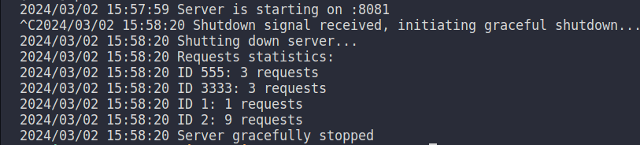

# In-Memory Task Manager

## Overview

In-Memory Task Manager is a simple, yet powerful Go application designed to demonstrate the basics of building a RESTful API server. This project showcases handling HTTP requests, managing in-memory data, and implementing graceful shutdown for Go servers.
<p align="center">
  
</p>
## Features

- **Task Management**: Create and manage tasks using simple API calls.
- **In-Memory Storage**: Quick and efficient data handling directly in memory.
- **Graceful Shutdown**: Safely shut down the server without losing data or interrupting current operations.
- **Concurrency Handling**: Built with concurrency in mind to handle multiple requests simultaneously.

## Getting Started

These instructions will get you a copy of the project up and running on your local machine for development and testing purposes.

### Prerequisites

- Go (version 1.18 or later)

### Installing

1. Clone the repository:

    ```bash
    git clone https://github.com/yourusername/in-memory-task-manager.git
    ```

2. Navigate to the project directory:

    ```bash
    cd in-memory-task-manager
    ```

3. Build the Docker image:

    ```bash
    docker build -t in-memory-task-manager .
    ```

4. Run the Docker container:

    ```bash
    docker run -p 8081:8081 in-memory-task-manager
    ```

    The server will start listening on port 8081.

## Usage

  ```bash
  curl http://localhost:8080/api/task/123
  ```

  For a valid `id`, you will receive a response in the format `{id}:{count}`, where `count` represents the number of times the `id` has been accessed.

## Running the Tests

To run the automated tests for this system:

```bash
go test ./...
```